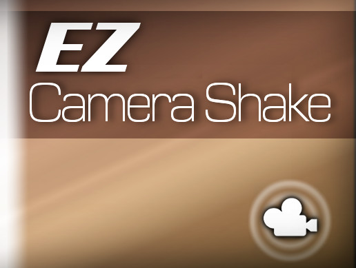

# EZ Camera Shake




EZ Camera Shake is a free powerful asset for achieving easy and quality camera shake in Unity. It was created by Road Turtle Games.  

It allows Unity programmers to add camera shake to their scenes with as little as one line of code, like:

```
CameraShaker.Instance.ShakeOnce(magn, rough, fadeIn, fadeOut);
```

It used to be available on the Unity Asset Store, but has since been removed and open sourced here.  

As of the time of writing this, this package works for Unity 2018 perfectly. **The `.unitypackage` can be downloaded [here](https://github.com/andersonaddo/EZ-Camera-Shake-Unity/releases/download/v1.0.5/EZ.Camera.Shake.v1.0.5.unitypackage).** PDF documentation is also included in the package.


## ❓FAQ
#### I don't want to read the docs! Show me how to use this visually.
Okay, here's a [video](https://www.youtube.com/watch?v=9A9yj8KnM8c).

#### The camera is now stuck at 0,0,0 and none of my other scripts can move it!
This is actually the expected behavour and is explained in the documentation! You can also read a bit about it in [#3](/../../issues/3) and [#4](/../../issues/4).

#### Are there any alternatives to EZ Camera Shake?
Yes, now there is. When this EZ Camera Shake was created (and also around the time it was open sourced), there weren't that many free and easy ways to achieve camera shake. Now, however, easy and complex shake behaviours can be made with Unity's free camera management package [Cinemachine](https://unity.com/unity/features/editor/art-and-design/cinemachine).

## 📋Change History
The original version uploaded on GitHub was v1.04

### [1.06] - 2020/05/23
- Replaced deprecated scene management methods for demo scene.  [@HexedHero](https://github.com/HexedHero)

### [1.05] - 2019/05/08
- Added the ability to add an offset to a camera's defualt (0,0,0) position.  [@axesve](https://github.com/axesve)
